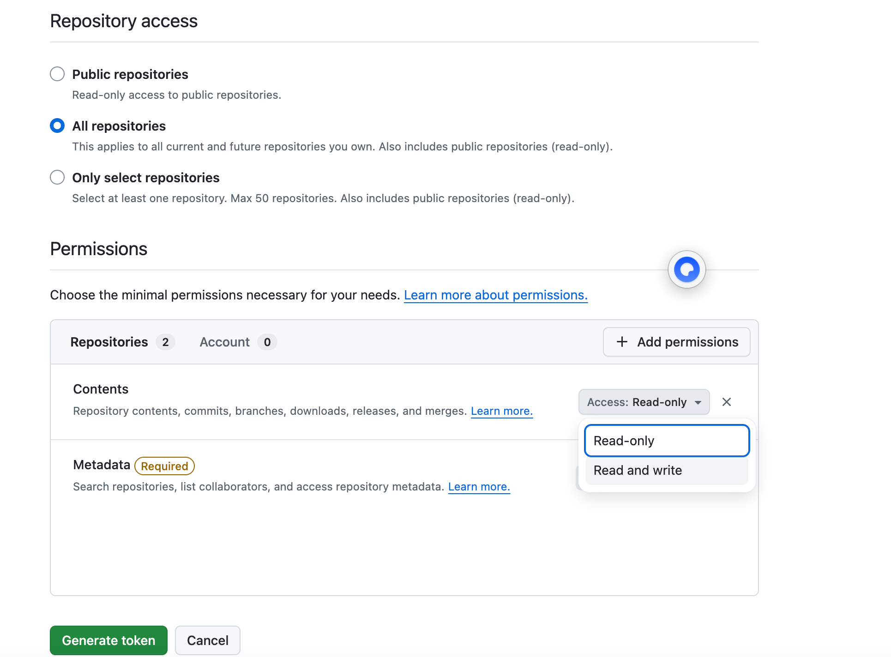
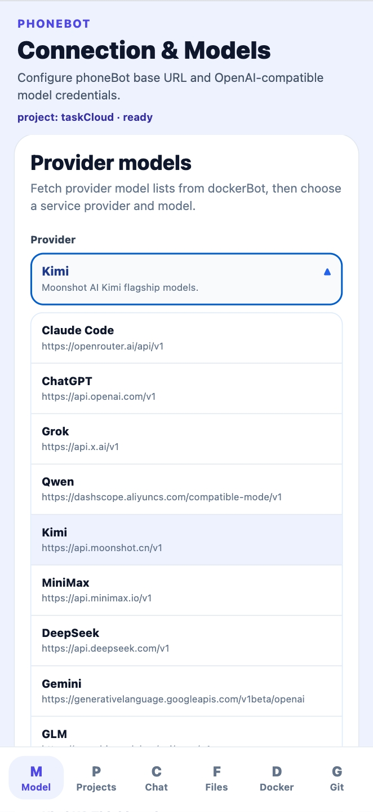
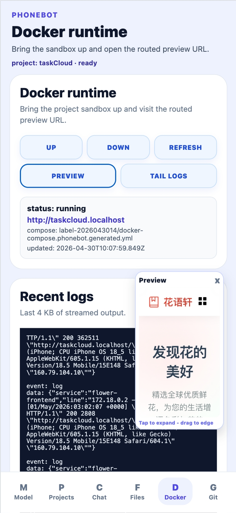
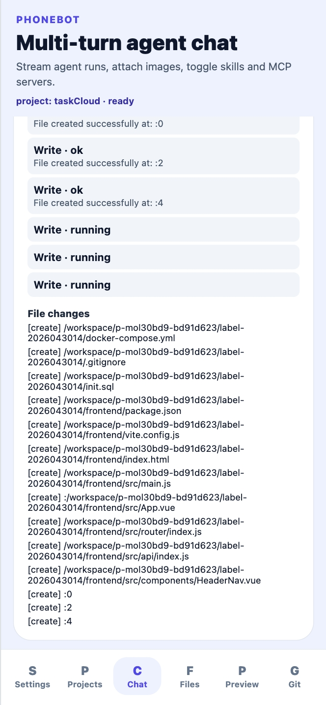
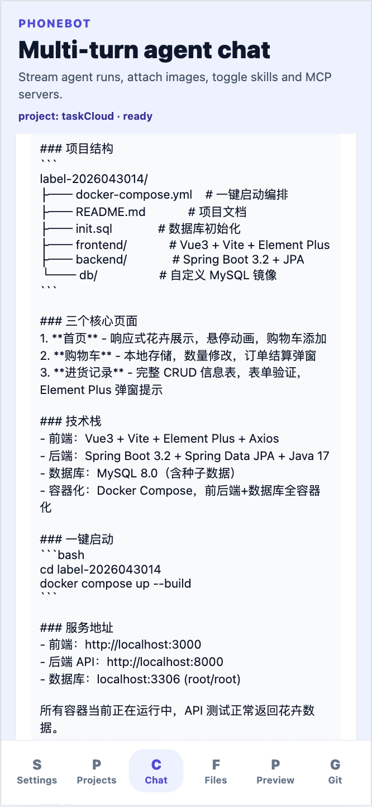

# webCursor Docker stack (one command)

This article describes how the three subprojects in an AI agent system—featuring fully automated development and one-click deployment—collaborate. 
Provide a Git repository and access token, and the system will take care of full-stack development and deployment, with mobile support so you can build anytime, anywhere—right from your phone.

Chinese version: [`README.zh.md`](./README.zh.md)

This directory contains a **dockerBot API + Agent sandbox**, a **clientCoder** Web IDE served by **Nginx**, and **phoneCoder Web** (static Expo export). Build inputs live entirely under `webCursor`; a single script builds and starts everything.

## Prerequisites

- **Docker Engine / Desktop** with **Compose v2** (`docker compose`).
- A running Docker daemon (`docker info` succeeds).
- **`openssl`** on the host whenever the `.env` encryption key is still a placeholder, so the script can generate one.

## One-command launch — run and explore the project

From a terminal `cd` into this directory:

```bash
chmod +x ./scripts/docker-stack.sh   # first time only
./scripts/docker-stack.sh            # default: build and run in detached mode
```

Equivalent:

```bash
./scripts/docker-stack.sh up
```

On first run, if `dockerBot/.env` is missing it is copied from `dockerBot/.env.example`; if `PHONEBOT_ENCRYPTION_KEY` is still a placeholder it is replaced with a random 64-character hex secret. SQLite and workspace data bind-mount under **`dockerBot/data/`**.

## URLs after startup

| Service | URL | Notes |
|------|-----|------|
| Server-side dockerBot API | `http://127.0.0.1:8080/api` | Base path for REST, SSE, etc. |
| Web clientCoder (Nginx) | `http://127.0.0.1:5371` | Static app; **`/api/*`** is **reverse proxied** to dockerBot API on the Compose network |
| Mobile phoneCoder Web | `http://127.0.0.1:3000` | Static web client |

### Suggested backend URL in clients

- **clientCoder**: in connection settings use **`http://127.0.0.1:5371/api`** (browser talks only to Nginx; Nginx forwards `/api`), or directly **`http://127.0.0.1:8080/api`**.
- **phoneCoder**: phones and other LAN devices must use the host’s **LAN IP**, e.g. `http://192.168.x.x:8080/api`. If you open phoneCoder Web only on the same machine in a desktop browser, the default pointing at `localhost:8080` is fine.

## Common commands

| Action | Command |
|------|---------|
| Start in foreground / follow logs | `./scripts/docker-stack.sh fg` (or `./scripts/docker-stack.sh foreground`) |
| Stop and remove stack containers | `./scripts/docker-stack.sh down` |
| List containers | `./scripts/docker-stack.sh ps` |
| Follow logs | `./scripts/docker-stack.sh logs -f` (supports the same filtering as `docker compose logs`) |
| Validate Compose | `./scripts/docker-stack.sh config` |

The Compose project name is **`webcursor-stack`**.

## Layout (summary)

- `docker-compose.stack.yml`: Stack definition.
- `scripts/docker-stack.sh`: `.env`/environment prep plus `docker compose up`.
- `dockerBot/`: Image build context for API and Agent (`Dockerfile`, `agent.Dockerfile`); runtime uses precompiled **`dist`** plus production dependency lockfiles; see `.env.example`.
- `clientCoder/`: Build context for the `clientcoder-nginx` image (Vite app source).
- `phoneCoder/`: Build context for the `phonecoder-web` image.
- `docker/`, `nginx/`: Dockerfiles and Nginx site configs used inside those images.

## Notes and collisions

1. **Host Docker socket**: Both `dockerbot-api` and `dockerbot-agent` mount **`/var/run/docker.sock`** so workloads can orchestrate sandbox/runtimes on **your machine’s Docker**. This does **not** run a nested full Docker daemon inside the containers.
2. **Fixed agent name**: The agent container name is **`phonebot-agent`** (must match `PHONEBOT_SANDBOX_CONTAINER` in `.env`). If another dockerBot setup from elsewhere uses that name or also binds host port **8080**, shut one stack down before starting the other.
3. **`dockerBot/dist` updates**: `dockerBot` here is a **prebuilt release layout**. After pulling upstream code changes, run **`npm ci && npm run build`** in a full-source dockerBot clone, copy the resulting **`dist`** (and matching `package.json` / `package-lock.json` if needed) into **`webCursor/dockerBot/`**, then run `./scripts/docker-stack.sh` again to rebuild images as needed.

---

If Compose fails because `.env` is missing, run `./scripts/docker-stack.sh` once so it bootstraps, or copy `dockerBot/.env.example` to `dockerBot/.env` and set a valid `PHONEBOT_ENCRYPTION_KEY`.

---

## Full-stack project development & deployment example

### Obtain a Git access token

Open **[GitHub personal access tokens](https://github.com/settings/personal-access-tokens)** (Avatar → **Settings** → **Developer settings** → **Fine-grained personal access tokens**).  
Create an access token and grant **Contents** — **Read and write** (**this is required**).



After you have the token, go to the **Projects** tab and create a project.

### Develop via multi-turn chat

**Example prompt:**

```
/skill prompt2repo-engineering-rules 
Follow the engineering skill rules: create folder label-2026043014 and implement the project inside label-2026043014 to spec. Below is my product prompt.

Generate a separated frontend/backend web project.

Flower shop management system with a cart-like workflow; include at least one page with an information table (similar to course selection) supporting full CRUD.

The home page must be responsive, with strong UI polish—no broken styles. Use the UI kit’s dialogs and toast/notification APIs; the interface should look deliberate and polished.

Strictly reproduce the UI from the design: Implement this design from Figma.
@https://www.figma.com/design/XXXXXXX?node-id=418-56098&m=dev

Frontend: Vue 3 + Vite + Element Plus; use axios against a REST API. Docker published port and app listen port must be **3000**.

Backend: Java + Spring Boot. Docker published port and app listen port must be **8000**.

Provide database code / migrations or operate the database for me. Use MySQL with Docker published port 3306.
```

If you have no Figma file, drop the Figma URL line from the prompt above.

**Suggested prompt structure:**

1. Full-stack skill: `/skill prompt2repo-engineering-rules`
2. Name the directory/project root the agent should create
3. Product requirements (features, workflows, responsive UI)
4. UI rules / Figma; you can attach a Figma link or use **Figma MCP** when configured
5. Frontend stack plus Docker/host port (**3000** in this example)
6. Backend stack plus Docker/host port (**8000** in this example)
7. Database stack and published port (**3306** here)

**Example outcome:**

| Models | Projects | Chat | Docker |
| :---: | :---: | :---: | :---: |
|  |  |  |  |


| Coding | README | Files | Preview |
| :---: | :---: | :---: | :---: |
|  |  |  |  |

### Open files & start Docker runtime

In **Files**, use the Docker icon on the project (or subdirectory) row to start the stack;  
then switch to **Preview** to open the running app.

### AI-assisted checklist QA

```
/skill prompt2repo-final-checklist 
Following the checklist, review and validate the full-stack project in label-2026043014
```

**Suggested prompt structure:**

1. QA skill: `/skill prompt2repo-final-checklist`
2. Name the directory / project slice to audit

### Commit & push on Git

Open the **Git** tab, run your usual commit/push workflow for the cloned project, and synchronize with the remote repository.

## Join the Star
